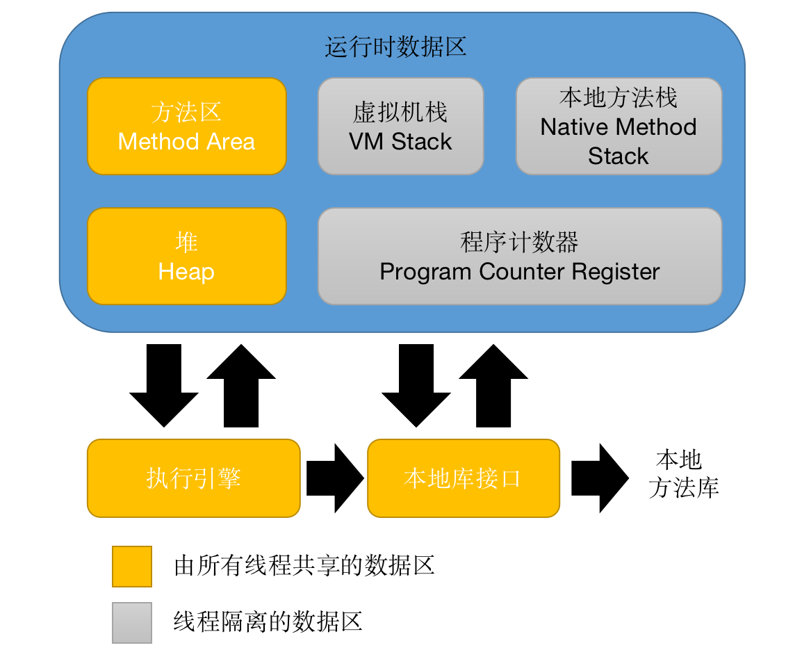
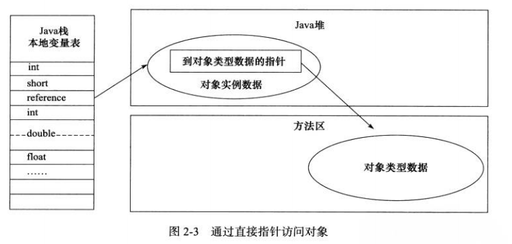

# 第2章 Java内存区域与内存溢出异常
[TOC]

## 2.2 运行时数据区域

Java虚拟机在执行Java程序的过程中会把它所管理的内存划分为若干个不同的数据区域。这些区域有各自的用途，以及创建和销毁的时间，有的区域随着虚拟机的进程的启动而一直存在，有些区域则是依赖用户线程的启动和结束而建立和销毁。根据《Java虚拟机规范》的规定，Java虚拟机所管理的内存将会包括以下几个运行时数据区域，如图2-1所示。

图2-1 Java虚拟机运行时数据区

### 2.2.1 程序计数器
- 程序计数器(Program Counter Register)是一块较小的内存空间，他可以看作是当前线程所执行的字节码的行号指示器。在Java虚拟机的概念模型里，字节码解释器工作时就是通过改变这个计数器的值来选取下一条需要执行的字节码指令，它是程序控制流的指示器，分支、循环、跳转、异常处理、线程恢复等基础功能都需要依赖这个计数器来完成。
- 由于Java虚拟机的多线程是通过线程轮流切换、分配处理器执行时间的方式来实现的，在任何一个确定的时刻，一个处理器（对于多核处理器来说是一个内核）都只会执行一条指令中的指令。因此，为了线程切换后能恢复到正确的位置，每条线程都需要有一个独立的程序计数器，各条线程之间计数器互不影响，独立存储，我们称这类内存区域为"线程私有"的内存。
- 如果程序正在执行一个Java方法，这个计数器记录的是正在执行的虚拟机字节码指令的地址；如果正在执行的是本地（Native）方法，这个计数器值则应为空（Undefined）。此内存区域是唯一一个没有规定任何OutOfMemoryError情况的区域。

### 2.2.2 Java虚拟机栈
- Java虚拟机栈也是线程私有的，它的生命周期与线程相同。虚拟机栈描述的是Java方法执行线程内存模型：每个方法被执行的时候，Java虚拟机都会同步创建一个战争用于存储局部变量表、操作数栈、动态链接、方法出口等信息。每一个方法被调用直至执行完毕的过程，就对应着一个栈帧在虚拟机栈中从入栈到出栈的过程。
- 局部变量表存放了编译期可知的各种Java虚拟机基本数据类型（boolean、byte、char、short、int、float、long、double）、对象引用和returnAddress类型（指向了一条字节码指令的地址）
- 这些数据类型在局部变量表中的存储空间以局部变量槽（Slot）来表示，其中64位长度的long和double类型的数据会占用两个变量槽，其余的数据类型只占用一个。
- 如果线程请求的栈深度大于虚拟机所允许的深度，将抛出StackOverflowError异常；如果Java虚拟机容量可以动态扩展，当栈扩展时无法申请到足够的内存会抛出OutOfMemoryError异常。

### 2.2.3 本地方法栈
- 本地方法栈与虚拟机栈所发挥的作用很相似，区别在于虚拟机栈为虚拟机执行Java方法（也就是字节码）服务，而本地方法栈则是为虚拟机使用到的本地方法服务。

### 2.2.4 Java堆

- 几乎所有的对象实例以及数组都应当在堆上分配。

- 垃圾收集器管理的主要区域。

- 从分配内存的角度，所有线程共享的Java堆中可以划分出多个线程私有的分配缓冲区（Theard Local Allocation Buffer, TLAB），以提升效率。

- Java堆可以实现成固定大小的，也可以是可扩展的，主流的Java虚拟机都是可扩展的（通过参数最大值：-Xmx和最小值：-Xms设定），Java堆没有内存分配实例对象，并且无法扩展时，将会抛出OutOfMemoryError异常。

### 2.2.5 方法区

- 和Java堆一样，是各个线程共享的内存区域，用于存储已被虚拟机加载的类型信息、常量、静态变量、及时编译器编译后的代码缓存等数据。
  - 类信息：即 Class 类，如类名、访问修饰符、常量池、字段描述、方法描述等。
- 关于“永久代”（Permanent Generation）这个概念：由于HotSpot虚拟机使用“永久代”来实现方法区，故许多Java程序员都习惯把方法区称呼为“永久代”，但这种设计更容易导致内存溢出问题。在JDK6的时候HotSpot开发团队就有放弃永久代，逐步改为采用本地内存（Native Memory）来实现方法区，到了JDK7，已经把原本放在永久代的字符串常量池、静态变量等移除，而到了JDK8，终于完全废弃了永久代的概念，改用了与JPockit、J9一样在本地内存中实现的元空间中 。
- 垃圾收集行为比较少，甚至可以不实现垃圾收集。这区域的内存回收目标主要是针对常量池的回收和对类型的卸载。
- 无法满足新的内存分配需求时，将抛出OutOfMemoryError异常。

### 2.2.6 运行时常量池

- 运行时常量池（Runtime Constant Pool）是方法区的一部分。Class文件中除了有类的版本、字段、方法、接口等描述信息外，还有常量池表（Constant Pool Table），用于存放编译期生成的各种字面量与符号引用，在类加载后存放到方法区。

### 2.2.7 直接内存

- 直接内存（Direct Memory）并不是虚拟机运行时数据区的一部分，但被频繁地使用，而且也可能导致OutOfMemoryError异常。
- 在JDK1.4中新加入了NIO（New Input/Output）类，引入了一种基于通道(Channel)与缓冲区（Buffer）的I/O方式，它可以使用Native函数库直接分配堆外内存，然后通过一个存储在Java堆里面的DirectByteBuffer对象作为这块内存的引用进行操作。这样能在一些场景显著提高性能，因为避免了在Java堆和Native堆中来回复制数据。
- 一般服务器管理员配置虚拟机参数时，会根据实际内存去设置-Xmx等参数信息，但经常忽略掉直接内存，使得各个内存区域总和大于物理内存限制，从而导致动态扩展时出现OutOfMemoryError异常。

## 2.3 HotSpot 虚拟机堆中的对象

这一小节将对 JVM 对 Java 堆中的对象的创建、布局和访问的全过程进行讲解。

### 2.3.1对象的创建

遇到一条New指令，虚拟机的步骤：

1. 检查这个指令的参数能否在常量池中定位到一个类的符号引用，并检查这个符号引用代表的类是否已被加载、解析和初始化过。如果没有，必须先把这个类加载进内存；

2. 类加载检查通过后，虚拟机将为新对象分配内存，类加载完就可以确定存储这个对象所需的内存大小；
3. 将分配到的内存空间初始化为零值；
4. 设置对象头（Object Header）中的数据，包括这个对象是哪个类的实例、如何才能找到类的元数据、对象的哈希码（实际在调用Object::hashCode()方法才计算）、对象的GC分代年龄等；
5. 此时从虚拟机的角度看，对象已经产生，但从 Java 程序的角度看，构造函数还没有执行。执行完初始化函数，一个真正的对象才算完全构造出来。

在第二步中，为对象分配内存，就是在内存划分一块确定大小的空闲内存，但存在两个问题：

1. 如何划分空闲内存和已被使用的内存？
   - 假设Java堆中内存是绝对规整的，空闲内存和被使用内存被分到两边，中间放置指针作为分界点的指示器，那分配内存就是把指针向空闲内存一定一段，这种方式成为“指针碰撞（Bump The Pointer）”。
   - 但如果Java堆内存不是规整的，那就没有办法简单地进行指针碰撞了，虚拟机需要维护一个列表，记录哪些内存块可以使用，在分配内存的时候，找到一块足够打的内存划分给对象实例，并更新列表上的记录，这种方式被称为“空闲列表（Free List）”。
   - 事实上，这由所采用的垃圾收集器是否带有空间压缩整理（Compact）的能力决定。因此，当使用Seria、parNew等带压缩整理过程的收集器时，系统采用的分配算法是指针碰撞，既简单又高效；而当使用CMS这种基于清除(Sweep)算法的收集器时，理论上只能采用较为复杂的空闲列表来分配内存。

2. 如何处理多线程下，内存分配问题？
   - 对分配内存空间的动作进行同步处理，实际上虚拟机采用CAS配上失败重试的方式保证更新操作的原子性。
   - 把内存分配的动作按照线程划分在不同的空间之中进行，即每个线程在Java堆中预先分配一小块内存，称为本地线程分配缓冲（Theard Local Allocation Buffer, TLAB）,哪个线程要分配内存就先在本地线程分配缓冲中分配，只有缓冲使用完了，分配新的缓存区时需要同步锁定。
   - 通过-XX:+/-UseTLAB 参数设置是否使用TLAB。

### 2.3.2对象的内存布局

- 对象头（Header）：
  - 第一部分：存储对象自身的运行时数据，如哈希码（HashCode）、GC分代年龄、锁状态标志、线程持有的锁、偏向线程ID、偏向时间戳等。（官方称之为“Mark Word”）。
  - 第二部分：类型指针，即对象指向它的类型元数据的指针，虚拟机通过这个指针来判断这个对象是哪个类的实例，如果是数组对象，将会在对象头存储数组长度，以确定对象大小。

- 实例数据（Instance Data）：
  - 在程序代码里面所有定义的各种类型的字段内容都必须记录。
  - 这部分的存储顺序受到虚拟机分配策略参数（-XX:FieldsAllocationStyle 参数）和Java源码中定义顺序的影响。
  - HotSpot虚拟机默认的分配顺序为longs/doubles、ints、shorts/chars、bytes/booleans、oops (Ordinary Object Pointers, OOPs)，相同宽度的字段总是被分配到一起存放，满足这个条件的前提下，父类定义的变量会出现在子类之前。

- 对齐填充（Padding）：

### 2.3.3 对象的访问定位

Java程序通过栈上的reference数据来操作堆上具体对象，主流的访问方式主要有以下两种：

- 使用句柄：Java堆可能会划分一块内存作为句柄池，reference中存储的就是对象的句柄地址，而句柄包含了对象实例数据与类型数据各自Juin的地址信息。结构如图2-2所示。
- 优势：在对象被移动（垃圾收集时移动对象是非常普遍的行为）时，只会改变句柄中的实例数据指针，而不需修改reference。

- 使用直接指针：Java堆中对象的内存布局必须考虑如何放置访问类型数据的相关信息，reference中存储的直接就是对象地址，如果只是访问对象本身，就不需要多一次间接访问的开销。如图2-3所示。
- 优势：速度快，节省一次指针定位的时间开销。

## 2.4 实战： OutOfMemoryError异常

### 2.4.1 Java堆溢出

- Java堆内存的OutOfMemoryError异常是实际应用最常见的内存溢出情况，异常堆栈信息“java.lang.OutOfMemoryError”会进一步提示“Java heap space”。
- 解决方法：
  - 首先通过内存映像分析工具（如Eclipse Memory Analyzer）对Dump出来的堆转储快照进行分析。分析清楚是出现内存泄漏（Memory Leak）还是内存溢出（Memory overflow），即导致OOM的对象是否是必要的。
  - 如果是内存泄漏，可进一步通过工具查看泄漏对象到GC Roots的引用链，找到泄漏对象是通过怎样的引用路径、与哪些GC Roots相关联，才导致垃圾收集器无法回收它们。根据泄漏对象的类型信息以及它到GC Roots 引用链的信息，一般可以比较准确地定位到这些对象创建的位置，进而找到产生内存泄漏的代码具体位置。
  - 如果是内存溢出，检查Java虚拟机的堆参数（-Xmx与-Xms）设置，检查代码对象生命周期是否过长、存储结构设计不合理等情况，减少程序运行的内存消耗。

### 2.4.2 虚拟机栈和本地方法栈溢出

- 线程请求的栈深度大于虚拟机所允许的最大深度，将抛出StackOverflowError异常。
- 如果虚拟机栈允许动态扩展，当扩展栈容量无法申请到足够的内存，将抛出OutOfMemoryError异常。

### 2.4.3方法区和运行时常量池溢出

- 运行时常量池溢出时，在OutOfMemoryError异常后面跟随的提示信息是“PermGen space”。
- 类加载过多，会导致方法区内存溢出，在实际的应用中，如Spring框架，会使用到CGLib这类字节码技术，会产生大量的动态类，容易导致内存溢出，需要注意垃圾回收；除此之外常见的还有大量JSP或动态JSP文件应用、基于OSGi的应用等。
- 在JDK8后，永久代完全退出，元空间作为替代者登场。在默认设置下，动态创建新类型已经很难使虚拟机出现产生方法区内存溢出。

### 2.4.4本机直接内存溢出

- `--XX:MaxDirectMemorySize`设置，如不指定，默认与Java堆最大值（-Xmx指定）一致。
- 出现的明显特征，Heap Dump文件不会看见明显的异常情况，如发现内存溢出后产生的Dump文件很小，而程序又直接或间接使用了DirectMemory（典型的间接使用是NIO），那可以考虑重点检查直接内存的问题。
