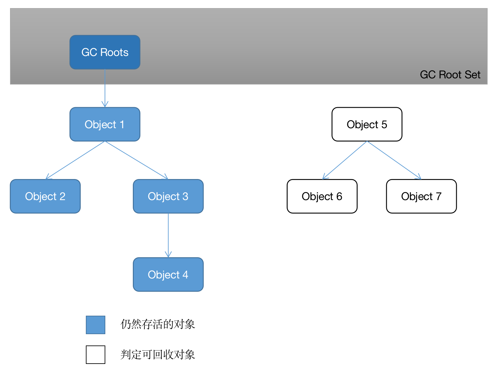

# 垃圾收集器与内存分配策略

## 3.1 概述
- 了解垃圾收集和内存分配的原因：当需要排查各种内存写出、内存泄漏问题时，当垃圾收集器成为系统达到更高并发量的瓶颈时，我们就必须对这些"自动化"的技术实施必要的监控和调节。
- 垃圾收集器关注Java堆和方法区的内存该如何管理。因为Java堆和方法区这两个区域有着很显著的不确定性：一个接口的多个实现类需要的内存可能会不一样，一个方法所执行的不同条件分支所需要的内存也可能不一样，只有处于运行期间，我们才能知道程序究竟会创建哪些对象，创建多少个对象，这部分内存的分配和回收是动态的。

## 3.2 对象已死？
垃圾收集器在对堆进行回收前，第一件事情就是要确定这些对象之中哪些还"存活"着，哪些已经"死去"（"死去"即不可能再被任何途径使用的对象）了。

### 3.2.1 引用计数算法
- Java虚拟机并不是通过引用计数算法来判断对象是否存活的。
- 举个简单的例子，请看代码清单3-1中的testGC方法：对象objA和objB都有字段instance，赋值令objA.instance = objB 及 objB.instance = objA，
除此以外，这两个对象再无任何引用，实际上这两个对象已经不可能再被访问，但是他们因为互相引用着对方，导致他们的引用计数都不为领，引用计数算法也就无法回收它们。
```java

/**
 * testGC()方法执行后，ObjA和ObjB会不会被GC呢？
 */
public class ReferenceCountingGC {
    public Object instance = null;

    private static final int _1MB = 1024 * 1024;

    /**
     * 这个成员属性的唯一意义就是占点内存，以便能在GC日志中看清楚是否有回收过
     */
    private byte[] bigSize = new byte[2 * _1MB];

    public static void testGC() {
        ReferenceCountingGC objA = new ReferenceCountingGC();
        ReferenceCountingGC objB = new ReferenceCountingGC();
        objA.instance = objB;
        objB.instance = objA;

        objA = null;
        objB = null;

        // 假设在这行发生GC，objA和objB是否能被回收？
        System.gc();
    }

    public static void main(String[] args) {
     testGC();
    }
}
```
运行结果：
```text
[GC (System.gc()) [PSYoungGen: 8034K->624K(76288K)] 8034K->632K(251392K), 0.0014423 secs] [Times: user=0.01 sys=0.00, real=0.00 secs] 
[Full GC (System.gc()) [PSYoungGen: 624K->0K(76288K)] [ParOldGen: 8K->394K(175104K)] 632K->394K(251392K), [Metaspace: 3161K->3161K(1056768K)], 0.0045513 secs] [Times: user=0.03 sys=0.00, real=0.01 secs] 
Heap
 PSYoungGen      total 76288K, used 1966K [0x000000076ab00000, 0x0000000770000000, 0x00000007c0000000)
  eden space 65536K, 3% used [0x000000076ab00000,0x000000076aceb9e0,0x000000076eb00000)
  from space 10752K, 0% used [0x000000076eb00000,0x000000076eb00000,0x000000076f580000)
  to   space 10752K, 0% used [0x000000076f580000,0x000000076f580000,0x0000000770000000)
 ParOldGen       total 175104K, used 394K [0x00000006c0000000, 0x00000006cab00000, 0x000000076ab00000)
  object space 175104K, 0% used [0x00000006c0000000,0x00000006c00629d0,0x00000006cab00000)
 Metaspace       used 3173K, capacity 4496K, committed 4864K, reserved 1056768K
  class space    used 349K, capacity 388K, committed 512K, reserved 1048576K
```
从运行结果可以清楚看到内存回收日志中包含"8034K->624K"，意味着虚拟机并没有因为这两个对象互相引用就放弃回收它们，这也从侧面说明了Java虚拟机并不是通过引用计数算法来判断对象是否存活的。

### 3.2.2 可达性分析算法
- 可达性分析算法的基本思路就是通过一系列成为"GC Roots"的根对象作为起始节点集，从这些节点开始，根据引用关系向下搜索，搜索过程所走过的路径称为"引用链"（Reference Chain），如果某个对象到GC Roots间没有任何引用链相连，或者用图论的话来说就是从GC Roots到这个对象不可达时，则证明此对象是不可能再被使用的。
- 如图3-1所示，对象object 5、object 6、object 7虽然互有关联，但是它们到GC Roots都是不可达的，因此它们将会被判定为可回收的对象。

<p style="text-align: center;">图3-1 利用可达性分析算法判定对象是否可回收</p>

在Java技术体系里面，固定可作为GC Roots的对象包括以下几种：
- 在虚拟机栈（栈帧中的本地变量表）中引用的对象，譬如各个线程被调用的方法堆栈中使用到的参数、局部变量、临时变量等。
- 在方法区中类静态属性引用的对象，譬如Java类的引用类型静态变量。
- 在方法区中常量引用的对象，譬如字符串常量（String Table）里的引用。
- 在本地方法栈JNI（即通常所说的Native方法）引用的对象。
- Java虚拟机内部的引用，如基本数据类型对应的Class对象，一些常驻的异常对象（比如NullPointerException、OutOfMemoryException）等，还有系统类加载器。
- 所有被同步锁（sysnchronized关键字）持有的对象。
- 反映Java虚拟机内部情况的JMXBean、JVMTI中注册的回调、本地代码缓存等。
- 根据用户所选用的垃圾收集器以及当前回收的内存区域不同，还可以有其他对象"临时性"地加入。


### 3.2.3 再谈引用
在JDK1.2版之后，Java对引用的概念进行了扩充，将引用分为强引用（Strongly Reference）、软引用（Soft Reference）、弱引用（Weak Reference）和虚引用（Phantom Reference）4种，这4种引用强度依次逐渐减弱。
- 强引用是最传统的"引用"的定义，是指在程序代码之中普遍存在的引用赋值，即类似于"Object obj = new Object（）"这种引用关系。永远不会被垃圾收集器回收。
- 软引用是用来描述一些还有用、但非必须的对象。
- 弱引用也是用来描述那些非必须对象，但是他的强度比软引用更弱一些，被弱引用关联的对象只能生存到下一次垃圾收集发生为止。
- 虚引用也称为"幽灵引用"或者"幻影引用"，它是最弱的一种引用关系。一个对象是否有虚引用的存在，完全不会对其生存时间造成影响，也无法通过虚引用来取得一个对象实例。为一个对象设置虚引用关联的唯一目的只是为了能再这个对象被收集器回收时收到一个系统通知。


### 3.2.4 生存还是死亡？
- 在可达性算法中被判定为不可达对象后，至少要经历两次标记过程对象才会真正死亡：如果对象在进行可达性分析后发现没有与GC Roots相连接的引用链，那它会被第一次标记，随后进行一次筛选，筛选的条件是此对象是否有必要执行finalize()方法。加入对象没有覆盖finalize()方法，或者finalize()方法已经被虚拟机调用过，那么虚拟机将这两种情况都视为"没有必要执行"。
- 如果这个对象呗判定为确有必要执行finalize()方法，那么该对象将会被放置在一个名为F-Queue的队列之中，并在稍后由一条虚拟机自动建立的、低调度优先级的Finalizer线程去执行它们的finalize()方法。finalize()方法是对象逃脱死亡命运的最后一次机会，如果对象在finalize()中重新与引用链上的一个对象建立关联即可避免被回收，譬如把自己（this关键字）赋值给某个类变量或者对象的成员变量。从代码清单3-2中我们可以看到一个对象的finalize()被执行，但是它仍然可以存活。
```java
/**
 * 此代码演示了两点：
 * 1.对象可以在被GC时自我拯救。
 * 2.这种自救的机会只有一次，因为一个 对象的finalize()方法最多只会被系统自动调用一次
 */
public class FinalizeEscapeGC {

    public static FinalizeEscapeGC SAVE_HOOK = null;

    public void isAlive() {
        System.out.println("Yes, I am still alive!");
    }

    @Override
    protected void finalize() throws Throwable {
        super.finalize();
        System.out.println("finalize method is exceted!");
        // 重新建立关联，避免被回收
        SAVE_HOOK = this;
    }

    public static void main(String[] args) throws InterruptedException {
        SAVE_HOOK = new FinalizeEscapeGC();

        // 对象第一次成功拯救自己
        SAVE_HOOK = null;
        System.gc();
        // 因为Finalizer方法优先级很低，暂停0.5秒以等待它
        Thread.sleep(500);
        if (SAVE_HOOK != null) {
            SAVE_HOOK.isAlive();
        } else {
            System.out.println("No, I am dead :(");
        }

        // 下面这段代码和上面的完全相同，但是这次自我拯救失败了
        SAVE_HOOK = null;
        System.gc();
        // 因为Finalizer方法优先级很低，暂停0.5秒以等待它
        Thread.sleep(500);
        if (SAVE_HOOK != null) {
            SAVE_HOOK.isAlive();
        } else {
            System.out.println("No, I am dead :(");
        }
    }
}
```
运行结果：
```text
finalize method is exceted!
Yes, I am still alive!
No, I am dead :(
```
- 从运行结果可以看到finalize()方法被执行，并且只执行了一次，因此第二段代码自救行动失败
- 官方不推荐使用finalize方法。finalize()能做的所有工作，使用try-finally或者其他方法都可以做得更好，更及时。


### 3.2.5 回收方法区
方法区的垃圾收集主要回收两个部分内容：废弃的常量和不再使用的类型。
- 回收废弃常量：一个字符串"java"曾经进入常量池，但是当前系统有没有任何一个字符串对象的值是"java"，换句话说，已经没有任何字符串对象引用常量池中的"java"常量，且虚拟机中也没有其他地方引用这个字面量。如果再这个时候发生内存回收就会被系统清理出常量池。常量池中其他类（接口）、方法、字段的符号引用也与此类似。
- 判断一个类型是否属于"不再被使用的类"需要满足下面三个条件：
  - 该类所有的实例都已经被回收，也就是Java堆中不存在该类及其任何派生子类的实例。
  - 加载该类的类加载器已经被回收。
  - 该类对应的java.lang.Class对象没有在任何地方被引用，无法在任何地方通过反射访问该类的方法。


## 3.3 垃圾收集算法
从如何判定对象消亡的角度出发，垃圾收集算法可以划分为"引用计数式垃圾收集"（Reference Counting GC）和"追踪式垃圾收集"（Tracing GC）两大类，这两类也常备称作"直接垃圾收集"和"间接垃圾收集"。本节所有算法均属于追踪式垃圾收集的范畴。

### 3.3.1 分代收集理论
当前商业虚拟机的垃圾收集器，大多数都遵循了"分代收集"（Generational Collection）的理论进行设计，它建立在两个分代假说之上：
- 1）弱分代假说（Weak Generational Hypothesis）：绝大多数对象都是朝生夕灭的。
- 2）强分代假说（Strong Generational Hypothesis）：熬过越多次垃圾收集过程的对象越难以消亡。<br/>
这两个分代假说共同奠定了多款常用的垃圾收集器的一致设计原则：收集器应该将Java堆划分出不同的区域，然后将回收对象依据其年龄（年龄即对象熬过垃圾收集过程的次数）分配到不同的区域之中存储。显而易见，如果剩下的都是难以消亡的对象，那就把它们集中放在一起，虚拟机便可以使用较低的频率来回收这个区域，这就同时兼顾了垃圾回收的时间开销和内存空间的有效利用。<br/>
在Java堆划分出不同的区域之后，垃圾收集器才可以每次只回收其中某一个或者某些部分的区域——因而才有了"Minor GC" "Major GC" "Full GC"这样的回收类型的划分；也才能够针对不同的区域安排与里面存储对象存亡特征相匹配的垃圾收集算法——因而展示出了"标记-复制算法" "标记-清除算法" "标记-整理算法"等针对性的垃圾收集算法。
- 3）跨代引用假说（Intergenerational Reference Hypothesis）：跨代引用相对于同代来说仅占极少数。
  - 这其实是可根据前两条假说逻辑推理得出的隐含推论：存在互相引用关系的两个对象，是应该倾向于同时生存或者同时消亡的。例如，如果某个新生代对象存在跨代引用，由于老年代对象难以消亡，该引用会使得新生代对象在收集时同样得以存活，进而在年龄增大之后晋升到老年代中，这时跨时代引用也随即被消除了。
  
**注意**<br/>
对于不同分代的名词定义：
- 部分收集（Partial GC）：指目标不是完整收集整个Java堆的垃圾收集，其中又分为：
  - 新生代收集（Minor GC/Yong GC）：指目标只是新生代的垃圾收集。
  - 老年代收集（Major GC/Old GC）：指目标只是老年代的垃圾收集。
  - 混合收集（Mixed GC）：指目标是收集整个新生代以及部分老年代的垃圾收集。目前只有GI收集器会有这种行为。
- 整堆收集（Full GC）：收集整个Java堆和方法区的垃圾收集。 


### 3.3.2 标记-清除算法
- 标记-清除算法是最基础的垃圾收集算法，该算法分为"标记"和"清除"两个阶段：首先标记出所有需要回收的对象，在标记完成后，统一回收掉所有被标记的对象，也可以反过来，标记存活的对象，统一回收所有未被标记的对象。标记过程就是对象是否属于垃圾的判定过程。
- 该算法有两个缺点：
  - 执行效率不稳定，如果Java堆中包含大量对象，而且其中大部分是需要回收的，这时必须进行大量标记和清除的动作，导致标记和清除两个过程的执行效率都随对象数量增长而降低。
  - 内存空间的碎片化问题，标记、清除之后会产生大量不连续的内存碎片，空间碎片太多可能会导致当以后再程序运行过程中需要分配较大对象时无法找到足够的连续内存而不得不提前触发另一次垃圾收集算法。

### 3.3.3 标记-复制算法
标记-复制算法常被称为复制算法，为了解决标记-清除算法面对大量可回收对象时执行效率低的问题。该算法将可用内存按容量划分为大小相等的两块，每次只使用其中的一块。当这一块用完了，就将还存活着的对象复制到另外一块上面，然后再把已使用的内存空间一次清理掉。

### 3.3.4 标记-整理算法
标记-整理算法标记的过程仍然与"标记-清除"算法一样，但后续步骤不是直接对可回收对象进行清理，而是让所有存活的对象都向内存空间一端移动，然后直接清理掉边界以外的内存。<br/>
标记-清理算法与标记-整理算法的本质差异在于前者是一种非移动式的回收算法，而后者是移动式的。


## 3.4 HopSpot的算法细节实现

### 3.4.1 根节点枚举
- 迄今为止，所有收集器在根节点枚举这一步骤都是必须暂停用户线程的，因此毫无疑问根节点枚举与之前提及的整理内存碎片一样会面临相似的"Stop The World"的困扰。
- 由于目前主流Java虚拟机使用的都是准确式垃圾收集，所以当用户线程停顿下来之后，其实并不需要一个不漏的检查完所有执行上下文和全局的引用位置，虚拟机应当是有办法直接得到哪些地方存放着对象引用的。
在HotSpot的解决方案里，是使用一组称为OopMap的数据结构来达到这个目的。一旦类加载动作完成的时候，HotSpot就会把对象内什么偏移量上是什么类型的数据计算出来，在即时编译（见第11章）过程中，也会在特定的位置记录下栈里和寄存器里哪些位置是引用。
这样收集器在扫描时就可以直接得知这些信息了 ，并不需要真正一个不漏地从方法区等GC Roots开始查找。 
  
  
  